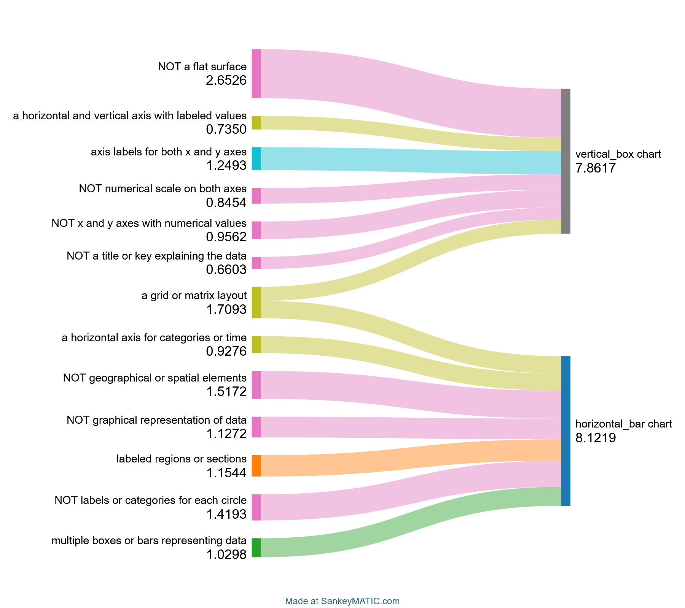
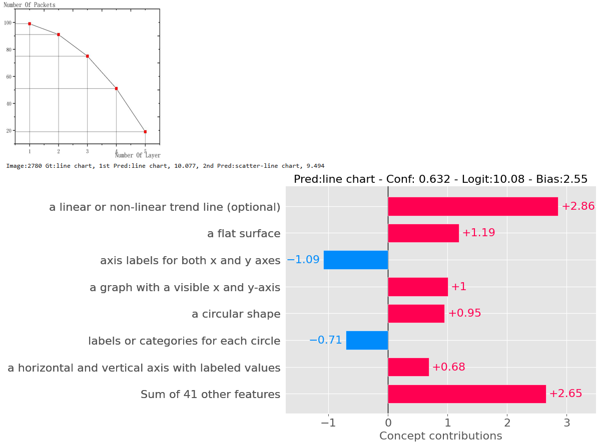
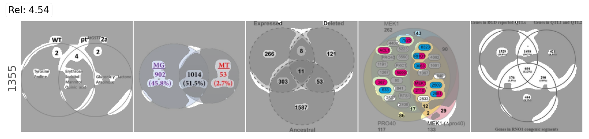
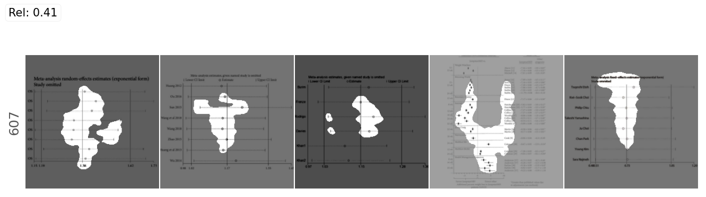

# A Feasibility Study of Concept-Based XAI Classification Methods on Chart Images

Josh Knize, Kenny Davila, Min Song

Supplementary code and notes for our paper evaluating two concept-based
explainability methods, **Concept Relevance Propagation** (CRP) and
**Label-free Concept Bottleneck Models** (LF-CBM), on chart image
classification.

Chart images are a challenging domain due to few non-synthetic
datasets, high visual similarity between classes, large class imbalance, and
significant heterogeneity within a class. We adapted both frameworks to the
CHART-Info 2024 dataset and a backbone from our previous work: Optimizing Chart
Image Classification (OCC). We found that neither method is usable out of
the box due to a wide interpretability gap, entangled concepts, poor concept
generation, and poor concept prediction.

This repository provides supplemental materials to the paper. It contains pieces that
are useful to read on their own such as the synthetic evaluation dataset generator,
the concept-prediction scoring code that the LF-CBM framework doesn't provide,
and notes on the adaptations each framework needed.

## Contents

| Path | Contents |
| --- | --- |
| [`synthetic-charts/`](synthetic-charts) | Seeded chart generator that emits per-image concept ground truth |
| [`concept-sets/`](concept-sets) | Every concept set we generated, with the filter config that produced it |
| [`lf-cbm-patches/`](lf-cbm-patches) | Concept-prediction scoring, plus notes on adapting LF-CBM to a ViT backbone |
| [`examples/`](examples) | Sample generated charts and the `labels.csv` they produced |
| [`figures/`](figures) | Figures from the paper |

## LF-CBM Concept Prediction

An LF-CBM labels each neuron in its concept bottleneck layer (CBL) with a 
natural-language concept, but neither the framework nor the original paper 
checks whether the corresponding neurons actually fires on correct images. 
The evaluation is a classification accuracy plus a crowdsourced study, but a 
model can score well on both without truly learning concepts.

We built a ground truth to test that directly. `generate_charts.py` renders
charts with randomized styling and derives concept labels from the rendering
decisions themselves, so `colorful points` is true for exactly those scatter
charts that were drawn with a colorful palette. `concept_eval.py` then scores
the bottleneck against those labels, treating each (image, concept) pair as an
independent binary problem.

Our best classifier reached a **95.4% macro-F1** on chart classification, reflecting
state-of-the-art classification performance, but this is how its *concept* prediction scored:

| Concept activation threshold | Recall % | Precision % | F1 % | Accuracy % |
| --- | --- | --- | --- | --- |
| 0.0 | 89.6 | 24.5 | 43.3 | 48.5 |
| 0.5 | 84.7 | 28.1 | 46.0 | 57.3 |
| 1.0 | 73.0 | 31.4 | 45.9 | 66.2 |
| 1.5 | 52.8 | 34.1 | 40.4 | 74.7 |
| 2.0 | 28.9 | 34.5 | 29.1 | 79.6 |
| 2.5 | 15.4 | 36.0 | 18.5 | 82.6 |
| 3.0 | 5.3 | 26.9 | 8.6 | 82.6 |

These scores are micro-averaged over all binary concept predictions. Note that the 
accuracy column is misleading since the no-information rate is **82.2%**. The F1
never clears 46%. This is consistent with the information-leakage results in the CBM 
literature.

## LF-CBM Concept Generation

LF-CBM's explanation output format is genuinely useful. It offers a global concept-to-class 
illustration and with per-image contributions:



The concepts flowing through them are the problem. GPT-generated concept sets
came back with heavy semantic overlap: tightening the cosine-similarity filter
from 0.9 to 0.8 cut 77 concepts to 24, but 7 of the 24 still referred to a
legend or key. Fine for prediction, bad for explanation — a local explanation
padded with four near-identical `axis` concepts explains less, not more.

Overlap is only half of it. The concepts are also rarely discriminative. Below
is Table 1 from the paper: everything GPT-3.5 Turbo Instruct returned when
prompted for the features that distinguish a *surface* chart, a class defined
by its complex three-dimensional geometry.

| Surface chart concepts |
| --- |
| a grid or lines to assist with reading… |
| a legend explaining the data |
| a legend or key explaining the symbols |
| a title describing the purpose of the chart |
| a title for the chart |
| data points plotted as symbols or markers |
| data points plotted on the chart |
| gridlines to aid in reading the data |
| horizontal and vertical axes with label… |
| x and y axes |

Reproduced as printed, including the two truncated entries. Not one of these
concepts is specific to a surface chart — every one of them applies equally to
an area, bar, line, scatter, box, or interval chart. Nothing here resembles
`a three-dimensional axis` or `a rugged three-dimensional shape`. This set was
generated with a modified prompt asking for features that identify a surface
chart *rather than other chart types*, which produced no better result than the
framework's default prompt; all other results in the paper use the default.

Every concept set we generated, along with the filter parameters and raw LLM
output behind each one, is in [`concept-sets/`](concept-sets).



## Concept Relevance Propagation

CRP produces relevance-ranked channels per class and visualizes each with its
most representative training samples. Below is the second most relevant channel
in `layer4.2.conv3` for predicting the `venn` class — 4.54% of the relevance
flowing into that prediction.



Three problems this surfaces, detailed in the paper:

- **Layer selection.** Concepts live at different depths. For example, a surface chart's
  3-D axes are a shallow feature while its rugged geometry is a deep one. Capturing relevant
  features across the entire depth of the model is very challenging.
- **Entanglement.** The channel above holds at least two concepts (a circular
  edge, small text labels). Propagating backward to decompose it produced
  *more* entangled channels rather than cleaner primitives.
- **Dispersion.** That channel is 2nd most relevant *globally* but only 3rd in
  its own most-representative sample, at 1.9%. This suggests that relevance is spread 
  thin across 2048 neurons.

Chart data widens the interpretability gap further. For example, the most representative
samples for a top horizontal-interval concept share a horizontal orientation,
aligned lines, points with whiskers, and a black-and-white palette. Nothing in the CRP output
allows us to determine which concept(s) are the meaningful ones.  



CRP also has no contrastive interface. It shows what supported the predicted
class, never why the alternatives lost.

## Methods and data evaluated

- **Concept Relevance Propagation** — Achtibat et al., *Nature Machine
  Intelligence* 5(9), 2023. Built on Zennit.
- **Label-free Concept Bottleneck Models** — Oikarinen, Das, Nguyen & Weng,
  ICLR 2023.
- **CHART-Info 2024** — Davila et al., ICPR 2024.
- **OCC (chart classification backbone)** — Knize & Davila, *Optimizing Chart
  Image Classification: A Study of Data Augmentation and Training Strategies*,
  ICDAR 2025.

## Citation

```bibtex
@inproceedings{knize2026feasibility,
  title     = {A Feasibility Study of Concept-Based {XAI} Classification Methods on Chart Images},
  author    = {Knize, Josh and Davila, Kenny and Song, Min},
  booktitle = {Document Analysis Systems (DAS)},
  year      = {2026}
}
```

## License

MIT — see [LICENSE](LICENSE). Code excerpts adapted from the Label-free-CBM
repository are marked as such in [`lf-cbm-patches/`](lf-cbm-patches); refer to
that project for its own terms.
